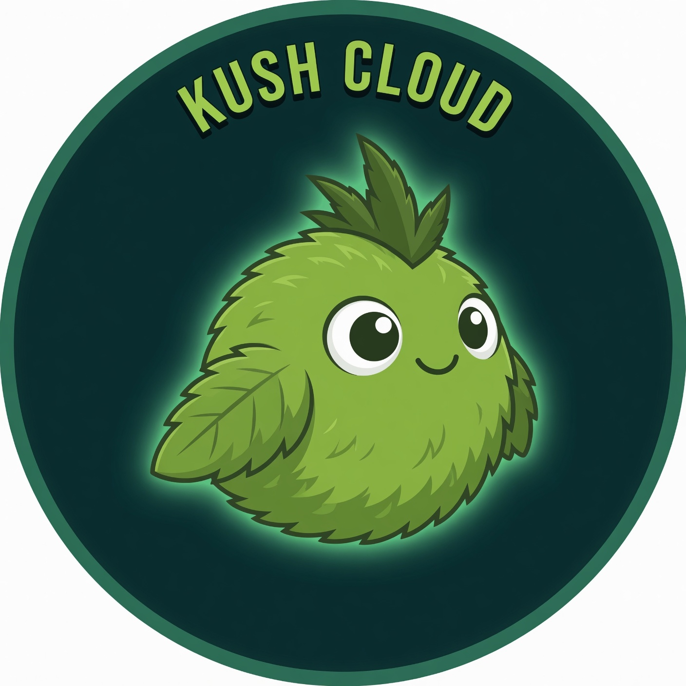
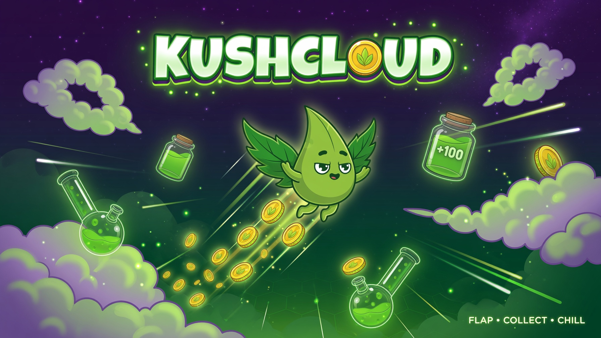

<p align="center">
  
</p>

<h1 align="center">🌿 KUSHCLOUD</h1>

<p align="center"><i>A chill one-tap arcade flyer — tap to fly, dodge the jars, grab the leaves.</i></p>

<p align="center">
  <a href="https://lin4cre.github.io/KushCloud/" target="_blank"><strong>🌐 Play Now</strong></a>
</p>

<p align="center">
  
  
  
  
</p>

---



## 🎮 How to Play

| Action | Desktop | Mobile |
|:-------|:--------|:-------|
| **Flap** | Space / ↑ / W | Tap anywhere |
| **Navigate menus** | Mouse / Tab | Tap |

Flap through the gaps between glass jars. Score points, collect coins, chain combos, and survive as long as you can. The world evolves as you score higher — from **Meadow** to **Cosmic** and beyond.

## ✨ Features

- 🎯 **One-tap gameplay** — Simple to pick up, hard to put down
- 🌍 **8 evolving worlds** — Meadow → Sunset → Night → Arctic → Volcanic → Cosmic → Celestial → Neon
- 🐦 **24 unlockable skins** — From Bud to Void, common to mythic rarity
- ✨ **15 trail effects** — Puff, spark, flame, rainbow, nebula, and more
- 💎 **Power-up pickups** — Magnet, Double Score, Slow Motion, Shield, Ghost Mode
- 🔥 **FRENZY mode** — Chain 3 perfect passes for 2× points
- ⚡ **Clutch escapes** — Near-death saves with bonus score
- 🎵 **Synthesized audio** — Zero audio files, all generated with Web Audio API
- 🎹 **Dynamic music** — Layers build with intensity as you score higher
- 🏆 **Local leaderboard** — Compete for the top spot
- 🛡️ **Revive system** — Spend coins to continue after death

## 🌍 Worlds

| World | Score | Vibe |
|:------|------:|:-----|
| 🌿 Meadow | 0 | Bright skies, green pipes |
| 🌅 Sunset | 25 | Warm oranges, golden hour |
| 🌙 Night | 50 | Deep indigo, glowing pipes |
| ❄️ Arctic | 80 | Icy blues, frozen landscape |
| 🌋 Volcanic | 120 | Red-hot lava, dangerous |
| 🌌 Cosmic | 180 | Purple nebula, starfield |
| ✨ Celestial | 250 | Golden heavens |
| 💜 Neon | 350 | Electric pink, maximum difficulty |

## 🚀 Quick Start

```bash
# Clone the repo
git clone https://github.com/LIN4CRE/KushCloud.git
cd KushCloud

# Install & run
npm install --legacy-peer-deps
npm run dev
```

Then open [http://localhost:5000](http://localhost:5000) in your browser.

## 🛠️ Tech Stack

| Tech | Purpose |
|:-----|:--------|
| **React 19** | UI framework |
| **TypeScript** | Type safety |
| **Canvas 2D** | 60fps game rendering |
| **Web Audio API** | Synthesized music & SFX |
| **Tailwind CSS 4** | UI styling |
| **Vite** | Build tool |

## 📊 Game Mechanics

```
Score = Base Points × Combo Multiplier × Frenzy Multiplier
       ┌─────────────────────────────────────────────────┐
       │  Combo: 1× → 2× (4 passes) → 3× (8) → ...10×  │
       │  Frenzy: 2× (3 perfect passes in a row, 6 sec)  │
       │  Clutch: +3× (extremely tight escape)            │
       │  Near Miss: +1× (close call bonus)               │
       │  Perfect Pass: +2× (centre of the gap)           │
       └─────────────────────────────────────────────────┘
```

## 📁 Project Structure

```
src/
├── components/     # React components (GameCanvas, KushLogo)
├── game/           # Core game engine & logic
│   ├── engine.ts   # Main game loop, physics, rendering
│   ├── audio.ts    # Web Audio synthesized music & SFX
│   ├── data.ts     # Skins, trails, worlds, power-ups
│   ├── powerups.ts # Power-up activation & modifiers
│   ├── storage.ts  # localStorage save/load
│   ├── leaderboard.ts # Local leaderboard
│   └── runProcessing.ts # Score validation & dedup
├── screens/        # UI screens (Menu, Play, Shop, etc.)
└── ui.tsx          # Shared UI components
```

## 🧪 Development

```bash
npm run dev          # Start dev server
npm run build        # Production build
npm run test         # Run tests
npm run test:coverage # Test coverage report
npm run typecheck    # TypeScript check
npm run lint         # ESLint check
npm run lint:fix     # Auto-fix lint issues
```

## 📜 License

MIT License — See [LICENSE](./LICENSE)

---

<p align="center">
  
  
</p>
